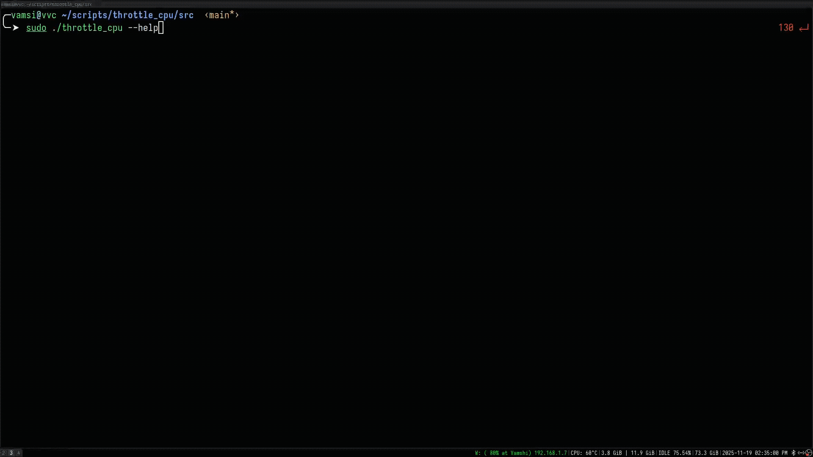

# Throttle CPU

A C program that monitors CPU temperature and automatically throttles CPU frequency to prevent overheating on Linux systems.

## Description

This program continuously monitors the CPU temperature and automatically reduces the CPU frequency when the temperature exceeds a user-defined limit.

## Features

- Real-time CPU temperature monitoring
- Automatic CPU frequency throttling
- Multiple throttling attempts with configurable parameters
- Graceful restoration of original CPU frequencies
- Support for multi-core processors
- Signal handling for clean program termination

## Prerequisites

- Linux operating system
- GCC compiler
- Root privileges (required for CPU frequency control)
- Access to system files:
  - `/sys/class/thermal/thermal_zone0/temp`
  - `/sys/devices/system/cpu/cpu*/cpufreq/`

## Installation

1. Clone the repository or download the source code
2. Compile the program:
   ```bash
   gcc throttle_cpu.c -o throttle_cpu
   ```

## Usage

Run the program with `root` privileges and specify the temperature limit in Celsius:

```bash
Usage: sudo ./throttle_cpu <Temperature_Limit> <Max_Attempts> <Wait_Time_After_Throttle>
Arguments:
  Temperature_Limit            : Maximum CPU temperature before throttling (1–110°C)
  Max_Attempts                 : Number of times the program will attempt to throttle (default: 5)
  Wait_Time_After_Throttle     : Wait time between throttle attempts, in seconds (default: 15)
```

Example:
```bash
sudo ./throttle_cpu 80    # Sets temperature limit to 80°C
```

## Configuration Constants

The program includes few fixed parameters(change them if you want):

```c
#define FREQUENCY_DECREMENT 500000      // Frequency reduction step (Hz)
#define WAIT_TIME_AFTER_TEMP_DROP 3000  // Wait time after temperature drops (seconds)
```


## How It Works

1. The program reads the current CPU temperature from the system
2. If the temperature exceeds the specified limit:
   - Reduces the maximum frequency for all CPU cores
   - Waits for a specified time period
   - Checks the temperature again
3. If the temperature is still high after maximum attempts:
   - Restores original frequencies
   - Exits the program
4. Handles Ctrl+C (SIGINT) gracefully by restoring original frequencies

## Error Handling

The program includes comprehensive error handling for:
- File operations
- Temperature and frequency reading/writing
- Invalid user input
- System calls

## Demo GIF


## Notes

- Requires root privileges due to system file access
- Temperature readings are in Celsius
- Frequency values are in Hertz
- The program continuously monitors temperature until interrupted
- Use Ctrl+C to safely exit and restore original frequencies

## License

This project is open source and available under the MIT License.
